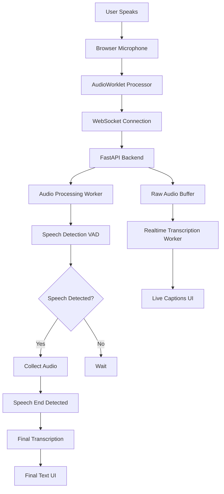
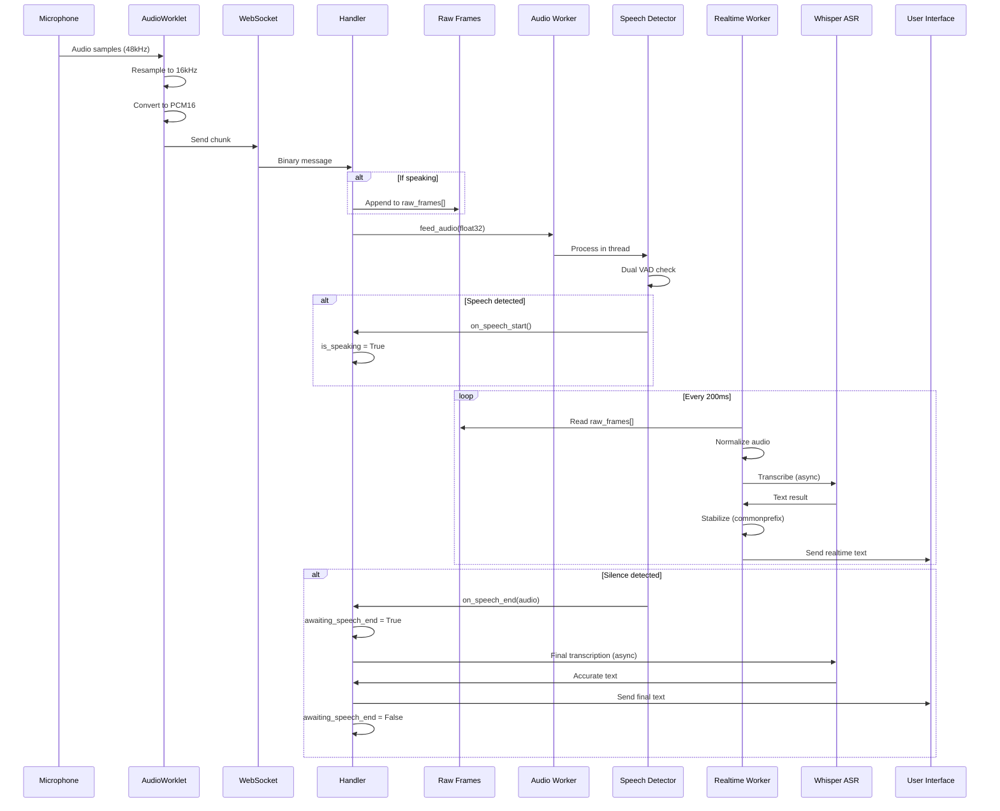
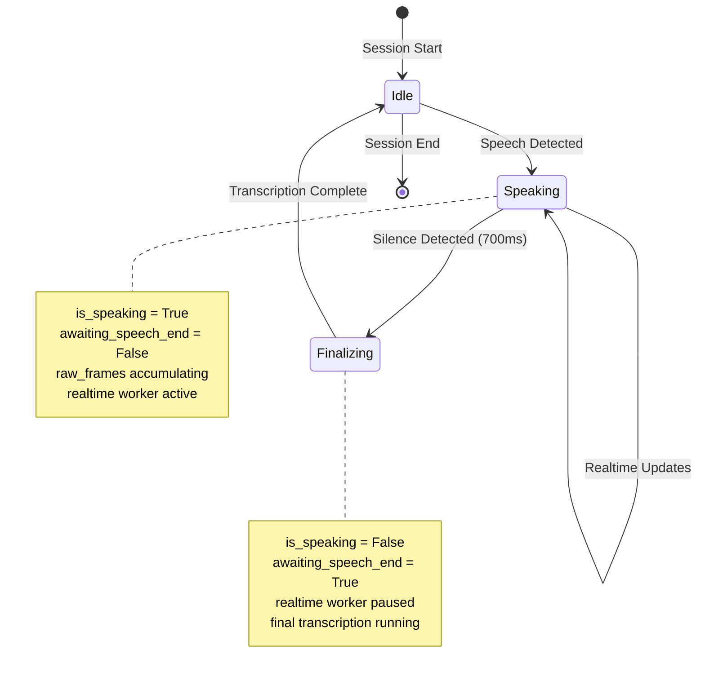
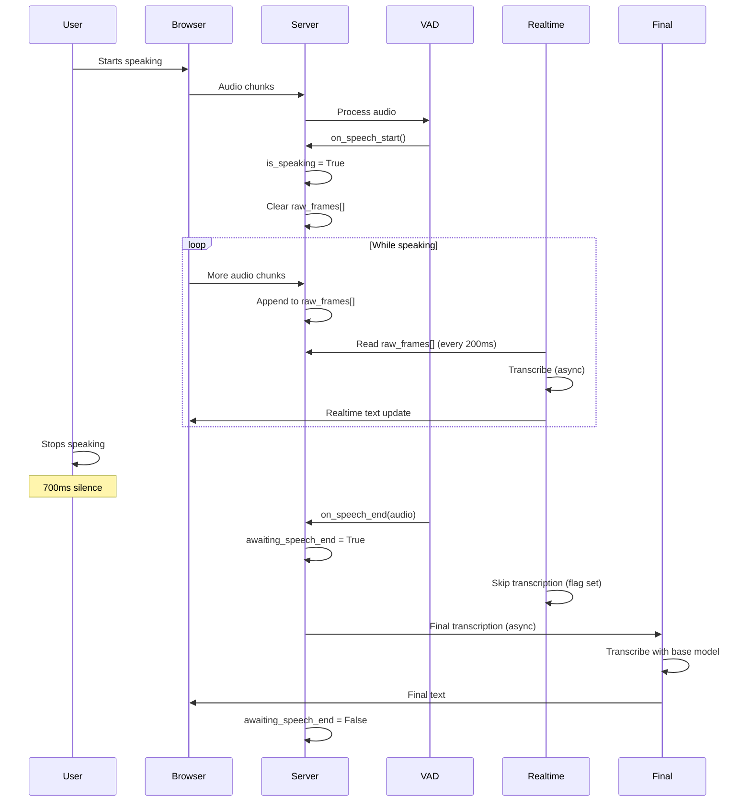
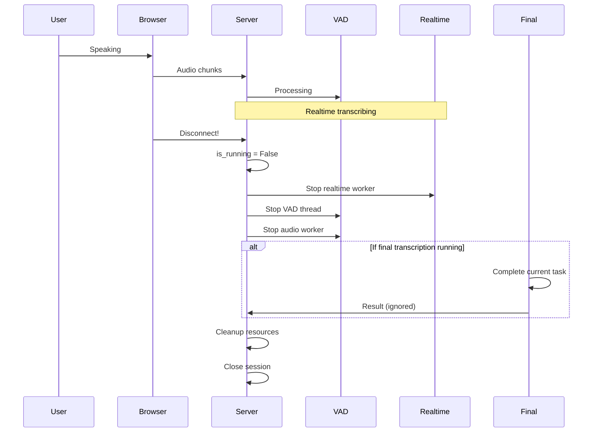

# Realtime Transcription System - Architecture Deep Dive

## Table of Contents
1. [System Overview](#system-overview)
2. [Component Architecture](#component-architecture)
3. [Data Flow](#data-flow)
4. [Threading Model](#threading-model)
5. [State Management](#state-management)
6. [Design Decisions](#design-decisions)
7. [Sequence Diagrams](#sequence-diagrams)

---

## System Overview

### What This System Does

The system provides **simultaneous** realtime and final transcription:

1. **Realtime Transcription** - Text appears live while you speak (like live captions)
   - Updates every 200ms
   - Uses fast model (tiny.en)
   - Shows intermediate results
   - Stabilized to prevent flickering

2. **Final Transcription** - Accurate text after you finish speaking
   - Triggers when speech ends
   - Uses accurate model (base.en)
   - Permanent record
   - Higher quality

### High-Level Architecture



**Key Insight:** The system has TWO parallel transcription paths:
- Realtime path: Fast, continuous, while speaking
- Final path: Accurate, triggered, after speaking

---

## Component Architecture

### Frontend Components

#### 1. AudioWorklet Processor
**Purpose:** Capture and preprocess audio in real-time

**How It Works:**
```
Microphone (48kHz) 
    ↓
Buffer accumulation (512 samples)
    ↓
Resample 48kHz → 16kHz
    ↓
Convert Float32 → PCM16 (Int16)
    ↓
Send to WebSocket
```

**Why Small Buffer (512 samples)?**
- 512 samples @ 48kHz = 10.7ms of audio
- After resampling to 16kHz = ~170 samples
- Enables ~30ms end-to-end latency
- Trade-off: More CPU, lower latency

**Design Decision:** Process in small chunks for responsiveness, not large chunks for efficiency.

---

#### 2. WebSocket Client
**Purpose:** Bidirectional communication between browser and server

**Message Types Sent:**
- **start** - Initiates session with config
- **bytes** - Raw PCM16 audio chunks
- **stop** - Ends session

**Message Types Received:**
- **realtime** - Live transcription updates (gray text)
- **fullSentence** - Final transcription (black text)
- **speech_start** - User started speaking
- **speech_end** - User stopped speaking

**Why WebSocket?**
- Full duplex (send audio, receive text simultaneously)
- Low overhead compared to HTTP polling
- Persistent connection for streaming

---

### Backend Components

#### 1. WebSocket Handler (Main Orchestrator)
**Purpose:** Coordinate all components and manage session state

**Responsibilities:**
1. Accept WebSocket connection
2. Initialize all components (ASR, VAD, workers)
3. Receive audio chunks
4. Accumulate raw audio frames
5. Manage component lifecycle
6. Clean up on disconnect

**State Variables:**
- `is_speaking` - Currently speaking?
- `is_running` - Session active?
- `awaiting_speech_end` - Finalizing transcription?
- `raw_frames[]` - Raw PCM16 buffer
- `text_storage[]` - For stabilization

**Why This Design?**
- Single source of truth for session state
- Centralized coordination
- Clear lifecycle management

---

#### 2. Raw Frames Buffer
**Purpose:** Store unprocessed audio for transcription

**How It Works:**
```
Audio arrives → If speaking → Append to raw_frames[]
                   ↓
            Realtime worker reads raw_frames[]
                   ↓
            Converts PCM16 → Float32
                   ↓
            Normalizes to -0.95 dBFS
                   ↓
            Sends to ASR model
```

**Why NOT Use Speech Detector's Buffer?**
- Speech detector's buffer is for VAD processing
- May be optimized/filtered differently
- Realtime needs RAW audio for best results
- Separation of concerns: VAD vs Transcription

**Key Insight:** Audio flows through multiple buffers for different purposes:
- Ring buffer (Speech Detector) = VAD processing
- Raw frames (WebSocket Handler) = Transcription
- Speech buffer (Speech Detector) = Final transcription audio

---

#### 3. Audio Processing Worker
**Purpose:** Non-blocking audio processing in dedicated thread

**Architecture:**
```
┌─────────────────────────────────────┐
│     WebSocket Handler (Main)        │
│                                     │
│   audio_worker.feed_audio() ────┐  │
└─────────────────────────────────│──┘
                                  │
                                  ↓
┌─────────────────────────────────────┐
│   Audio Processing Worker Thread    │
│                                     │
│   ┌──────────────────────┐         │
│   │   Queue (maxsize)    │         │
│   │   - Non-blocking put │         │
│   │   - Drops if full    │         │
│   └──────────┬───────────┘         │
│              ↓                      │
│   ┌──────────────────────┐         │
│   │  Processing Loop     │         │
│   │  - Get from queue    │         │
│   │  - Feed to VAD       │         │
│   └──────────────────────┘         │
└─────────────────────────────────────┘
```

**Why a Separate Thread?**
- VAD processing is CPU-intensive
- Can't block WebSocket I/O
- Queue provides buffering for bursts
- Graceful degradation (drops if overloaded)

**Design Pattern:** Producer-Consumer with bounded queue

---

#### 4. Speech Detector (VAD)
**Purpose:** Detect when user starts/stops speaking

**Dual VAD Architecture:**
```
Audio Input
    │
    ├─→ WebRTC VAD (Fast, Simple)
    │      ↓
    │   Speech? (Yes/No)
    │
    └─→ Silero VAD (ML-based, Accurate)
           ↓
        Speech? (Yes/No)

Result = WebRTC OR Silero
         (If either says speech → Speech!)
```

**Why Dual VAD?**
- **WebRTC**: Fast, works well for clear speech
- **Silero**: Better for noisy environments, accents
- **OR logic**: More sensitive, fewer missed words
- **Trade-off**: Might pick up more background noise

**State Machine:**
```
┌─────────┐
│ SILENCE │
└────┬────┘
     │ Speech detected
     ↓
┌──────────┐
│ SPEAKING │──→ Accumulating audio
└────┬─────┘
     │ Silence for 700ms
     ↓
┌─────────────────┐
│ SPEECH COMPLETE │──→ Trigger final transcription
└─────────────────┘
     │
     ↓
┌─────────┐
│ SILENCE │
└─────────┘
```

**Parameters:**
- `post_speech_silence` - 700ms of silence = speech ended
- `min_speech_duration` - 0ms (accept any length)
- WebRTC sensitivity - 2 (moderate)
- Silero sensitivity - 0.4 (moderate)

---

#### 5. Realtime Transcription Worker
**Purpose:** Provide live captions while user is speaking

**How It Works:**

```
┌──────────────────────────────────────┐
│   Async Background Task              │
│                                      │
│   Loop every 200ms:                  │
│                                      │
│   1. Check if speaking               │
│      ├─ No → Sleep, continue         │
│      └─ Yes → Proceed                │
│                                      │
│   2. Check awaiting_speech_end       │
│      ├─ Yes → Skip (finalizing)      │
│      └─ No → Proceed                 │
│                                      │
│   3. Get raw_frames[]                │
│      - Join PCM16 chunks             │
│      - Convert to Float32            │
│      - Normalize to -0.95 dBFS       │
│                                      │
│   4. Transcribe (async/non-blocking) │
│      - Use executor pool             │
│      - tiny.en model (fast)          │
│      - VAD filter enabled            │
│                                      │
│   5. Stabilize text                  │
│      - Common prefix of last 2       │
│      - Reduces flickering            │
│                                      │
│   6. Send to UI                      │
│      - WebSocket message             │
│      - Type: "realtime"              │
└──────────────────────────────────────┘
```

**Why Every 200ms?**
- Balance between responsiveness and CPU load
- Too fast: Excessive processing, flickering
- Too slow: Laggy user experience
- 200ms = Perceived as "real-time"

**Why Async/Non-blocking?**
- Can't block event loop
- Multiple sessions need to run
- Transcription takes ~100-300ms
- Use thread pool executor

---

#### 6. Commonprefix Stabilization
**Purpose:** Prevent text from flickering as transcription refines

**How It Works:**

```
Transcription 1: "Hello how are"
Transcription 2: "Hello how are you"

Common Prefix: "Hello how are"  ← Show this!
```

**Algorithm:**
1. Store last 2 transcription results
2. Find longest common prefix
3. Display only the stable prefix
4. Text only changes when both agree

**Example Sequence:**
```
Time  | Raw Transcription    | Stable Display
------|----------------------|------------------
0.2s  | "Hello"             | "Hello"
0.4s  | "Hello how"         | "Hello"  (common prefix)
0.6s  | "Hello how are"     | "Hello how"
0.8s  | "Hello how are you" | "Hello how are"
1.0s  | "Hello how are you" | "Hello how are you"  (stable!)
```

**Why This Works:**
- Model gradually refines transcription
- Early results are unstable
- Prefix is most confident part
- User sees smooth progression

---

#### 7. ASR (Automatic Speech Recognition)
**Purpose:** Convert audio to text using Whisper model

**Two-Model Strategy:**

| Aspect | Realtime Model | Final Model |
|--------|----------------|-------------|
| Model | tiny.en | base.en |
| Speed | ~100ms | ~500ms |
| Accuracy | Good | Excellent |
| Use | Live captions | Permanent text |
| Updates | Continuous | Once per sentence |

**Double VAD Explained:**

```
Level 1: Speech Detector VAD
    ↓ (Filters obvious silence)
Raw audio with speech segments
    ↓
Level 2: ASR Internal VAD
    ↓ (Filters pauses, breath, noise)
Clean speech for transcription
```

**Why Double VAD?**
- **Level 1 (Speech Detector)**: Segment management
  - Decides when to start/stop recording
  - Manages callbacks and state

- **Level 2 (ASR VAD)**: Audio quality
  - Removes non-speech within segments
  - Improves transcription accuracy
  - Filters breath sounds, clicks

**Not Redundant:** Different purposes, both needed!

---

#### 8. Audio Normalization
**Purpose:** Ensure consistent volume for ASR model

**The Problem:**
```
Quiet speaker: [-0.1, 0.05, -0.08, ...]  (Low amplitude)
Loud speaker:  [-0.9, 0.85, -0.92, ...]  (High amplitude)

Model trained on: [-1.0 to 1.0 range with typical -0.5 peaks]
```

**The Solution:**
```
1. Find peak: max(abs(audio)) = 0.1
2. Normalize: audio / peak = [-1.0, 0.5, -0.8, ...]
3. Scale: audio * 0.95 = [-0.95, 0.475, -0.76, ...]

Result: Consistent volume,  not clipping
```

**Why -0.95 dBFS (not -1.0)?**
- -1.0 = Maximum possible (risk of clipping)
- -0.95 = Safety margin for digital processing
- Industry standard for audio normalization
- RealtimeSTT's proven value

---

## Data Flow

### Audio Journey Through The System



---

## Threading Model

### Thread Architecture

```
┌────────────────────────────────────────────────────────────┐
│                     Main Process                            │
│                                                             │
│  ┌─────────────────────────────────────────────────────┐  │
│  │         AsyncIO Event Loop (Main Thread)            │  │
│  │                                                      │  │
│  │  - WebSocket I/O                                    │  │
│  │  - Message routing                                  │  │
│  │  - State management                                 │  │
│  │  - Realtime worker (async task)                     │  │
│  │  - Final transcription (async task)                 │  │
│  └─────────────────────────────────────────────────────┘  │
│                                                             │
│  ┌─────────────────────────────────────────────────────┐  │
│  │      Audio Processing Worker Thread                 │  │
│  │                                                      │  │
│  │  - Queue processing                                 │  │
│  │  - Feed to speech detector                          │  │
│  │  - Non-blocking                                     │  │
│  └─────────────────────────────────────────────────────┘  │
│                                                             │
│  ┌─────────────────────────────────────────────────────┐  │
│  │        Speech Detector VAD Thread                   │  │
│  │                                                      │  │
│  │  - Ring buffer processing                           │  │
│  │  - Dual VAD computation                             │  │
│  │  - State machine logic                              │  │
│  │  - Callback invocation                              │  │
│  └─────────────────────────────────────────────────────┘  │
│                                                             │
│  ┌─────────────────────────────────────────────────────┐  │
│  │       Multiprocessing Pool (4 workers)              │  │
│  │                                                      │  │
│  │  - ASR transcription tasks                          │  │
│  │  - Isolated process space                           │  │
│  │  - Heavy computation                                │  │
│  └─────────────────────────────────────────────────────┘  │
└────────────────────────────────────────────────────────────┘
```

### Why This Design?

**Main Thread (AsyncIO):**
- Handle I/O efficiently
- Coordinate components
- Manage state
- Non-blocking operations

**Worker Thread (Audio Processing):**
- Offload from main thread
- Continuous processing
- Queue-based buffering

**VAD Thread:**
- CPU-intensive VAD processing
- Independent of I/O
- Real-time requirements

**Process Pool:**
- ASR is computationally expensive
- Isolated for model loading
- Parallel processing for multiple sessions
- GIL avoidance

**Communication:**
- Main ↔ Worker: Queue (thread-safe)
- Worker ↔ VAD: Direct calls (same worker thread)
- Main ↔ Pool: Async executor
- VAD → Main: Callbacks via asyncio.run_coroutine_threadsafe

---

## State Management

### Session State Variables

```
┌──────────────────────────────────────────────┐
│           WebSocket Session State            │
├──────────────────────────────────────────────┤
│                                              │
│  is_speaking: bool                           │
│    - Currently detecting speech?             │
│    - Controls raw_frames[] accumulation      │
│    - Gates realtime transcription            │
│                                              │
│  is_running: bool                            │
│    - Session active?                         │
│    - Controls all worker loops               │
│    - Set False on disconnect                 │
│                                              │
│  awaiting_speech_end: bool                   │
│    - Finalizing last speech?                 │
│    - Prevents realtime during final          │
│    - Avoids hallucinations                   │
│                                              │
│  raw_frames: List[bytes]                     │
│    - PCM16 audio chunks                      │
│    - Cleared on speech_start                 │
│    - Read by realtime worker                 │
│                                              │
│  text_storage: List[str]                     │
│    - Last N transcriptions                   │
│    - For common prefix calc                  │
│    - Provides stability                      │
│                                              │
│  session_id: str                             │
│    - Unique session identifier               │
│    - For logging and tracking                │
│                                              │
└──────────────────────────────────────────────┘
```

### State Transitions



---

## Design Decisions

### 1. Why Raw Frames Buffer?

**Option A (Wrong):** Use speech detector's buffer
```
Problem: Speech detector optimizes buffer for VAD
         May filter/process audio differently
         Not designed for transcription quality
```

**Option B (Correct):** Separate raw frames buffer
```
Benefits: Unprocessed audio
          Optimal for transcription
          Independent of VAD
          Full control over preprocessing
```

**Decision:** Maintain separate raw_frames[] buffer

---

### 2. Why await_speech_end Flag?

**Without Flag:**
```
t=0: User stops speaking
t=100ms: VAD detects silence
t=200ms: Realtime worker wakes up
         → Transcribes leftover/silence audio
         → Model hallucinates text!
t=300ms: Final transcription starts
```

**With Flag:**
```
t=0: User stops speaking
t=100ms: VAD detects silence
         → Sets awaiting_speech_end = True
t=200ms: Realtime worker wakes up
         → Checks flag
         → Skips transcription ✓
t=300ms: Final transcription completes
         → Clears flag
```

**Decision:** Implement awaiting_speech_end flag

---

### 3. Why Commonprefix Stabilization?

**Raw Transcriptions (Flickering):**
```
0.2s: "Hell"
0.4s: "Hello h"
0.6s: "Hello"      ← Regression!
0.8s: "Hello how"
1.0s: "Hello how are"
```

**With Commonprefix (Stable):**
```
0.2s: "Hell"
0.4s: "Hell"       ← Common prefix
0.6s: "Hell"       ← Stays stable
0.8s: "Hello how"  ← Progressive
1.0s: "Hello how"  ← Progressive
```

**Decision:** Use common prefix for stability

---

### 4. Why Double VAD?

**Single VAD (Speech Detector Only):**
```
Input: "Hello [breath] how are you?"
        ↓
Speech Detector: Segments entire phrase
        ↓
ASR: Transcribes "Hello *uh* how are you?"
        ↑
     Noise included!
```

**Double VAD (Speech Detector + ASR):**
```
Input: "Hello [breath] how are you?"
        ↓
Speech Detector: Segments entire phrase
        ↓
ASR VAD: Filters internal silence
        ↓
ASR: Transcribes "Hello how are you?"
        ↑
     Clean!
```

**Decision:** Keep both VAD layers

---

### 5. Why Async Executors for ASR?

**Synchronous (Blocking):**
```
User 1 speaks → Transcribe (300ms) → BLOCKED
User 2 speaks → Wait...
User 3 speaks → Wait...
```

**Async with Executor:**
```
User 1 speaks → Submit to pool → Continue
User 2 speaks → Submit to pool → Continue  
User 3 speaks → Submit to pool → Continue

All transcribe in parallel!
```

**Decision:** Use multiprocessing pool with async executors

---

## Sequence Diagrams

### Happy Path: Single Speech Segment



---

### Error Scenario: WebSocket Disconnect During Transcription



---

## Performance Characteristics

### Latency Breakdown

```
Total Latency: ~300-500ms
├─ Audio Capture: 10-30ms (buffer size)
├─ Network: 5-20ms (WebSocket)
├─ Queue Wait: 0-10ms (worker processing)
├─ VAD Processing: 5-15ms (dual VAD)
├─ Normalize: 1-2ms
└─ ASR Transcription: 100-300ms (model dependent)
```

### Throughput

- **Single session:** ~60 concurrent audio chunks/sec
- **Multiple sessions:** Limited by CPU and model capacity
- **Bottleneck:** ASR transcription (CPU-bound)

### Resource Usage

- **Memory per session:** ~50-100MB
  - ASR model: 40MB (tiny.en) or 140MB (base.en)
  - Audio buffers: 5-10MB
  - State: 1-2MB

- **CPU per session:**
  - Idle: <1%
  - Speaking: 20-40% (realtime transcription)
  - Finalizing: 40-80% (final transcription)

---

## Summary

### Key Architectural Principles

1. **Separation of Concerns**
   - VAD for detection
   - Raw buffer for transcription
   - Separate models for realtime vs final

2. **Non-Blocking Operations**
   - Async I/O
   - Queue-based workers
   - Executor pools for heavy tasks

3. **Dual Processing Paths**
   - Realtime: Fast, continuous, approximate
   - Final: Accurate, one-time, definitive

4. **State Management**
   - Clear state variables
   - Explicit transitions
   - Flag-based coordination

5. **Audio Quality**
   - Double VAD for noise reduction
   - Normalization for consistency
   - Raw buffer for fidelity

### Why This Architecture Works

- **Responsive:** Non-blocking design, small buffers
- **Accurate:** Dual VAD, proper normalization, dual models
- **Stable:** Commonprefix stabilization, state flags
- **Scalable:** Multi-threaded, process pool, async
- **Reliable:** Clear state management, proper cleanup

---

*Architecture documented based on working implementation and RealtimeSTT patterns*
